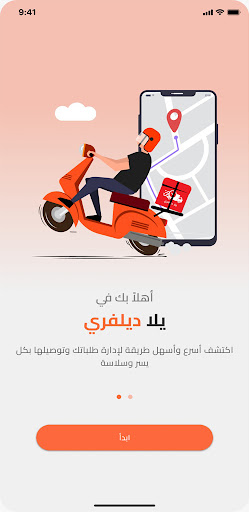
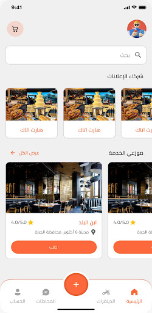
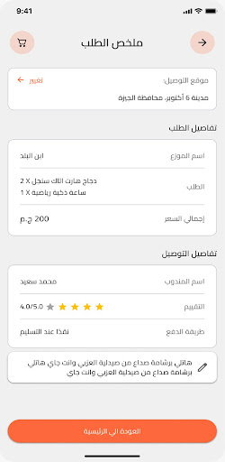

<div align="center">

# 🚀 Yalla Delivery

### A full-featured cross-platform delivery application built with Flutter & Firebase


</div>

---

## 📱 Overview

**Yalla Delivery** is a production-ready delivery application developed for a client, enabling seamless ordering and real-time delivery tracking. Built with Flutter for cross-platform support (Android, iOS, Web), and powered by Firebase for a scalable backend.

The app features a clean, localized UI supporting multiple languages, smooth onboarding flows, and a robust architecture following Clean Architecture and BLoC state management principles.

---

## ✨ Features

- 🔐 **Authentication** — Phone/OTP-based login via Firebase Auth with PIN code entry
- 🌍 **Localization** — Full multi-language support (Arabic & English) using `easy_localization`
- 📦 **Real-time Data** — Live order tracking and updates powered by Cloud Firestore
- ⭐ **Ratings** — In-app delivery rating system
- 🎨 **Polished UI** — Native splash screen, smooth page transitions, custom bottom navigation
- 💾 **Offline Support** — Local caching with Hive for a seamless offline experience
- 📐 **Responsive Design** — Adaptive layouts using `flutter_screenutil`
- 🔔 **State Management** — Predictable, scalable state via Flutter BLoC

---

## 🛠️ Tech Stack

| Layer | Technology |
|---|---|
| **Framework** | Flutter 3.x / Dart 3.5 |
| **State Management** | Flutter BLoC |
| **Backend** | Firebase (Auth, Firestore) |
| **Local Storage** | Hive + SharedPreferences |
| **Dependency Injection** | Injectable + GetIt |
| **Architecture** | Clean Architecture + DDD |
| **Code Generation** | Freezed, JSON Serializable, Build Runner |
| **Localization** | easy_localization |
| **UI Extras** | flutter_screenutil, flutter_svg, flutter_rating_stars |

---

## 📁 Project Structure

```
lib/
├── core/               # Shared utilities, constants, error handling
├── features/           # Feature-based modules (auth, orders, etc.)
│   ├── data/           # Repositories, data sources, models
│   ├── domain/         # Entities, use cases, repository interfaces
│   └── presentation/   # BLoC, pages, widgets
└── main.dart
```

---

## 🚀 Getting Started

### Prerequisites

- Flutter SDK `^3.5.0`
- Dart SDK `^3.5.0`
- Firebase project configured ([guide](https://firebase.google.com/docs/flutter/setup))

### Installation

```bash
# 1. Clone the repository
git clone https://github.com/salahsaleh1015/yalla_delivery.git
cd yalla_delivery

# 2. Install dependencies
flutter pub get

# 3. Run code generation
dart run build_runner build --delete-conflicting-outputs

# 4. Run the app
flutter run
```

### Firebase Setup

1. Create a Firebase project at [console.firebase.google.com](https://console.firebase.google.com)
2. Enable **Authentication** (Phone) and **Cloud Firestore**
3. Download `google-services.json` → place in `android/app/`
4. Download `GoogleService-Info.plist` → place in `ios/Runner/`

---

## 📦 Key Dependencies

```yaml
# UI & UX
flutter_screenutil: ^5.9.3        # Responsive sizing
smooth_page_indicator: ^1.2.0     # Onboarding indicators
pin_code_fields: ^8.0.1           # OTP input
flutter_native_splash: ^2.4.2     # Splash screen
convex_bottom_bar: ^3.2.0         # Bottom navigation
flutter_svg: ^2.2.1               # SVG assets

# State & Logic
flutter_bloc: ^8.1.6              # State management
injectable: ^2.5.1                # Dependency injection
get_it: ^8.2.0                    # Service locator
dartz: ^0.10.1                    # Functional programming

# Firebase
firebase_core: ^3.11.0
firebase_auth: ^5.5.3
cloud_firestore: ^5.6.8

# Local Storage
hive: ^2.2.3
shared_preferences: ^2.5.3

# Code Generation
freezed_annotation: ^2.4.1
json_annotation: ^4.9.0
```

---

## 📸 Screenshots

> *Add your app screenshots here*

| Onboarding | Home | Order Tracking |
|:---:|:---:|:---:|
|  |  |  |

---

## 👨‍💻 Developer

**Salah Saleh** — Flutter Developer

[](https://github.com/salahsaleh1015)

---

## 📄 License

This project was developed for a client and is not open for redistribution.  
All rights reserved © 2024 Salah Saleh.
